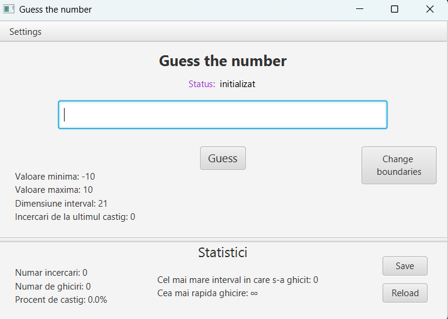

# GuessTheNumber

A little game in which you have to guess a random number between two selected limits.

## Gameplay:
**Default limits**: [-10, 10]

**Guess button**: press it after you type a number in the text field

**Change boundaries button**: If you want an easier or harder difficulty you can change the boundaries in which the random number will be generated, you will do this in the dialog shown after you press it

**Save button**: You can save the game statistics, you enter your name in the pop-up dialog (default folder for the saves will be your Documents folder, you can also change it as you like it)

**Load button**: You can reload your previous saved game statistics, you enter your name in the pop-up dialog (you must have the save path selected on the folder from which you want to reload a save)

**Menu options**:  
- Save path option: Here you can select the folder where you want your saves to go, or from what folder you want to reload your saves
- Language: You can select another language in the dialog shown
- Cheats option: there is only a cheat option:
  - Show number

**Warning**: If you activate a cheat you can't save anymore.
The number will be crypted in the save files to avoid non-fair saves (the encryption is very easy to reach in the source code, but please don't do it :) )

## GUI Screenshot

## Features:
- Variable range
- Saving progress
- Reloading progress
- Cheats
- (new) Language selection

## Used technologies:
- Java
- JavaFX
- Maven
